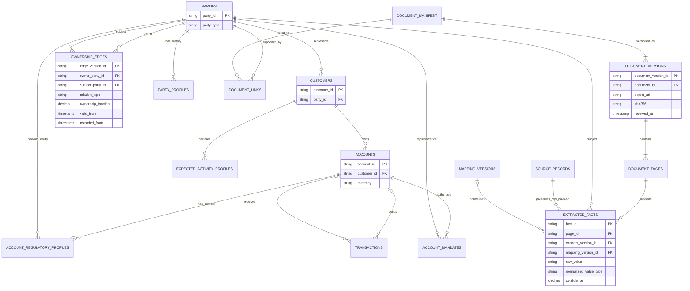
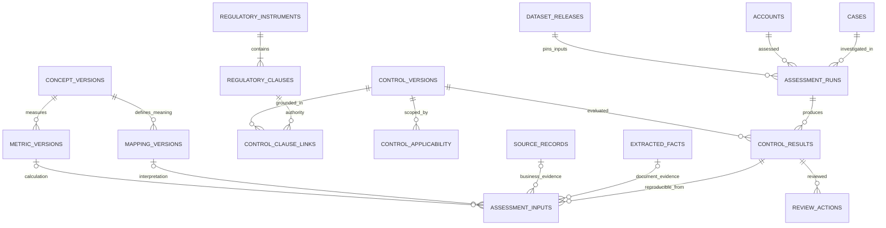
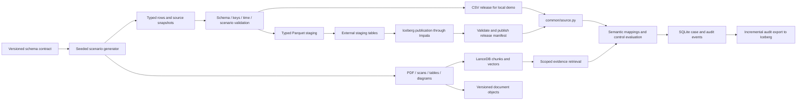

# KYC data catalog, schema and Impala publication design

Proposed design · 2026-09-24 · companion to [the implementation plan](kyc_multimodal_regulatory_semantics_plan.md). No source tables, application code or remote systems have been modified by this design.

## Dataset to build

Keep the configured baseline of 2,000 customers, 3,000 accounts and 100,000 transactions. Enrich 12 existing customer groups and approximately 30 of their accounts; those are a subset, not a replacement population. Create linked fictional holding companies, counterparties and natural persons as parties without making every party a bank customer. Target roughly 60–80 enriched parties, 50–80 ownership/control links, 120 document versions, 300–500 pages and 1,000–2,000 extracted assertions. Counts beyond the baseline are generation targets, not current inventory.

Use a fixed seed, scenario date and stable IDs. Include SG/HK booking institutions, SGD/HKD/USD/CNY amounts, English/Chinese names, and CN/MY counterparties. Cover a year of document/ownership history and retain the current transaction generator's monitoring chronology. Ensure document issue/receipt dates make sense relative to alert cutoffs. Scenario truth and expected outcomes live in a test-only directory, outside all source adapters, Lance indexes and agent inputs.

| Dossier scenario | Groups | Deliberate data complexity |
|---|---:|---|
| Consistent dossiers | 3 | Valid multilingual aliases; different address roles; coherent ownership |
| Ownership/control discrepancies | 3 | Representative vs owner, two-level ownership, nominee/control relation or cycle |
| Documentary evidence problems | 2 | Stale registry extract, expired ID-style fixture, missing page, poor OCR |
| Activity/funding discrepancies | 2 | Cross-currency activity, internal transfers, funds/wealth mismatch |
| Temporal and regional differences | 2 | SG/HK accounts, rule/profile change, evidence received after original assessment |

All customer-facing documents carry synthetic markings. No real identity document numbers, QCC-issued branding or purported official certification. Native PDF, image-only PDF/PNG, ownership SVG/PNG and CSV attachments provide meaningful modality differences. Preserve native text and independently extracted OCR text, with extraction mode clearly labeled.

## Storage and namespace contract

| Location | Responsibility | Local demo | Warehouse deployment |
|---|---|---|---|
| `aml_ref` | Business records and extracted assertions | Typed `data/releases/<release>/ref/*.csv` | Iceberg tables queried by Impala |
| `aml_gov` | Published concept, mapping, metric and control definitions | Versioned YAML plus generated CSV | Iceberg publication of the same approved definitions |
| `aml_audit` | Reproducible assessments and case audit history | SQLite authoritative; snapshot files | Append-only reporting exports to Iceberg; not live app writes |
| Knowledge/object store | PDFs, images, text chunks, vectors | Local assets and embedded LanceDB | Object URIs plus LanceDB/Lance index; SQL metadata remains joinable |
| Test fixtures | Generator truth, expected outcomes | Tests only | Never published to investigation datasets |

Impala is the query engine; Iceberg is the structured table format. PDF/image bytes and vector arrays are not copied into ordinary Impala columns. SQL tables retain versioned IDs, URIs, checksums and extracted facts.

## Common metadata and types

The catalog describes **logical keys**. Publication validators enforce uniqueness, referential integrity and history rules rather than relying on warehouse PK/FK enforcement.

Every published row has `release_id STRING`, `schema_version STRING`, `record_hash STRING`, `source_system STRING`, and `ingested_at TIMESTAMP` (UTC). Physical uniqueness is `(release_id, logical_primary_key)` when releases coexist. Cross-table joins must bind the same release as well as business keys. Never join different releases accidentally by ID alone.

Mutable business assertions carry `valid_from`, `valid_to`, `recorded_from`, `recorded_to` (all TIMESTAMP, upper bounds exclusive, nullable upper bound means open). Valid time describes the world; recorded time describes when the system knew it. Historical queries filter both. Closing/revising an assertion produces a new release; the old release stays reproducible. Published definition versions use effective intervals and publication/review metadata. Events retain `event_at` rather than pretending to be slowly changing dimensions.

| Logical value | CSV representation | Arrow / Impala representation |
|---|---|---|
| IDs, codes, original-script names | UTF-8 strings; preserve leading zeros | string / STRING |
| Money | Exact decimal text; currency in separate column | decimal128(20,4) / DECIMAL(20,4) |
| Fractional ownership | 0–1 decimal, not mixed percent/fraction | decimal128(12,9) / DECIMAL(12,9) |
| FX rate | Exact decimal text; base/quote/source/date explicit | decimal128(24,12) / DECIMAL(24,12) |
| Business date | `YYYY-MM-DD` | date32 / DATE |
| Timestamp | ISO 8601 with Z, normalized to UTC at parsing | timestamp(us), UTC convention / TIMESTAMP |
| Boolean | `true` / `false` | bool / BOOLEAN |
| Missing value | Reserved `\\N` token; literal token rejected by validator | null / NULL |
| Source payload / safe expression AST | Quoted, escaped JSON string | string / STRING |

CSV uses a header, UTF-8, RFC-style quoted fields and doubled embedded quotes. Multiline JSON/text is handled by a real CSV parser. Empty string is distinct from null; `NA` is not automatically null. Explicit schemas replace pandas type inference. Constrain decimal ranges before conversion; do not round money via binary float. Small lookup tables stay unpartitioned initially. Partition large event tables by event month only after measuring data size; avoid partitions per customer/document.

## Table metadata: business and KYC (`aml_ref`)

`→` denotes a logical foreign key. Column lists below describe business columns in addition to common metadata.

| Table / change | Grain and logical PK | Key columns / links | Purpose and history |
|---|---|---|---|
| `parties` NEW | One stable entity; `party_id` | `party_type` (PERSON/LEGAL_ENTITY), `display_name` | Identity anchor; display name is not a historical legal-name assertion |
| `party_profiles` NEW | One profile assertion version; `profile_version_id` | `party_id → parties`, `legal_name`, `legal_form`, `incorporation_country`, `registration_status`, `source_record_id` | Bitemporal; conflicting source assertions may coexist |
| `customers` EXTEND | One bank customer; `customer_id` | Existing fields + `party_id → parties` | Existing API compatibility; legacy beneficial_owner field becomes display-only |
| `party_identifiers` NEW | One identifier assertion; `identifier_version_id` | `party_id`, `scheme`, `issuer_country`, `identifier_value`, `source_record_id` | Bitemporal; UEN/company number/USCC remain scheme-specific |
| `party_aliases` NEW | One name assertion; `alias_version_id` | `party_id`, `name`, `language`, `alias_type`, `source_record_id` | Bitemporal; legal, former, trading and transliterated names |
| `party_addresses` NEW | One role-specific address assertion; `address_version_id` | `party_id`, `address_role`, `raw_address`, `normalized_address`, `country`, `source_record_id` | Bitemporal; mailing/registered/business/residential kept distinct |
| `ownership_edges` NEW | One ownership/control assertion; `edge_version_id` | `owner_party_id → parties`, `subject_party_id → parties`, `relation_type`, `ownership_fraction`, `voting_fraction`, `source_record_id` | Bitemporal; fractions nullable for control roles, cycles detected |
| `accounts` EXTEND | One account; `account_id` | Existing `customer_id → customers`, type/status/date/currency | Preserve existing ownership model in v1; joint-account mandates are separate |
| `account_regulatory_profiles` NEW | One account context version; `account_profile_version_id` | `account_id`, `booking_entity_party_id`, `branch_code`, `booking_jurisdiction`, `product_code`, `regulated_activity`, `source_record_id` | Bitemporal; selects applicable rule packs |
| `account_mandates` NEW | One authority assertion; `mandate_version_id` | `account_id`, `person_party_id`, `authority_role`, `source_record_id` | Bitemporal; signatory/representative is not beneficial ownership |
| `transactions` EXTEND | One posted movement; `transaction_id` | Existing endpoints/time/amount/currency + `counterparty_party_id`, `booking_date`, `reversal_of_id`, `source_record_id` | Event; amount becomes exact decimal; preserve endpoint direction semantics |
| `devices` KEEP | Existing login observation; `device_id` | Existing `account_id`, fingerprint, IP, login time | Preserve current grain/compatibility; repeated-device history must not collapse observations |
| `kyc_reviews` NEW | One review event; `review_id` | `customer_id`, nullable `account_id`, `review_type`, `completed_at`, `next_due_at`, `risk_tier`, `policy_control_version_id`, `source_record_id` | Event; expected review date has policy provenance |
| `expected_activity_profiles` NEW | One declared metric/scope version; `activity_profile_version_id` | `customer_id`, nullable `account_id`, `metric_version_id`, `direction`, `expected_amount`, `currency`, `period_unit`, `source_record_id` | Bitemporal; NULL account means explicit customer scope |
| `funding_sources` NEW | One funding assertion; `funding_version_id` | `customer_id`, nullable `account_id`, nullable `transaction_id`, `funding_type`, `amount`, `currency`, `source_record_id` | Bitemporal; funding of a particular relationship/activity |
| `wealth_sources` NEW | One accumulated-wealth assertion; `wealth_version_id` | `party_id`, `wealth_type`, `description`, `estimated_amount`, `currency`, `source_record_id` | Bitemporal; owner/customer wealth distinct from account funding |
| `screening_results` NEW | One screening candidate result; `screening_result_id` | `party_id`, `list_version`, `candidate_reference`, `match_status`, `screened_at`, `source_record_id` | Event; a candidate is not a confirmed match; retain list snapshot |
| `fx_rates` NEW | One published rate observation; `rate_id` | `base_currency`, `quote_currency`, `rate_date`, `rate_source`, `rate`, `published_at` | Immutable observation; selected rate ID enters assessment inputs |
| `source_records` NEW | One immutable upstream record version; `source_record_id` | `source_dataset`, `source_key`, `source_version`, `payload_uri`, `payload_hash`, `observed_at` | Raw business/registry/OCR payload provenance; sensitive content by reference |
| `document_manifest` NEW | One logical document; `document_id` | `document_type`, `issuer_label`, `is_synthetic` | Stable document identity; not inherently owned by only one customer |
| `document_links` NEW | One document-to-context link; `document_link_id` | `document_id`, `party_id`, nullable `customer_id`, nullable `account_id`, `link_role` | Many-to-many association; validated for consistency; not an ACL grant |
| `document_versions` NEW | One immutable file version; `document_version_id` | `document_id`, `version_no`, `mime_type`, `object_uri`, `sha256`, `language`, `issued_at`, `received_at`, `expires_at`, `supersedes_version_id` | Old binary retained; receive time prevents future-evidence leakage |
| `document_pages` NEW | One page in a file version; `page_id` | `document_version_id`, `page_no`, `preview_uri`, `width`, `height`, `text_uri` | Stable page citation; original content by URI |
| `extracted_facts` NEW | One extraction assertion; `fact_id` | `document_version_id`, `page_id`, `subject_party_id`, `raw_field`, `raw_value`, `concept_version_id`, nullable `mapping_version_id`, typed normalized value, unit/currency, bbox, confidence, method/version, `source_record_id` | Preserve conflicting assertions; values typed as string/decimal/date/bool with one populated type; OCR is not a verified fact |

Shared documents can link to several parties/accounts without duplicating their binary. Page/bbox refer to the exact document version. A finding may also use structured source records without a document; an absent PDF is not necessarily absent evidence.

## Table metadata: semantics and controls (`aml_gov`)

Published YAML remains the authoring source for these definitions; CSV/Iceberg are versioned runtime/reporting representations. Do not author a second, divergent ruleset directly in SQL.

| Table | Grain / PK | Required fields and links |
|---|---|---|
| `concept_versions` | One concept version; `concept_version_id` | `concept_id`, `label`, `definition`, `value_type`, `status`, effective dates |
| `mapping_versions` | One contextual mapping version; `mapping_version_id` | Source dataset/field/term, `concept_version_id`, relation type, context predicate, safe transformation AST, reviewer/publication/effective dates |
| `metric_versions` | One metric definition; `metric_version_id` | Concept link, formula ID/version, grain, direction, window semantics, currency/FX policy, completeness requirement |
| `regulatory_instruments` | One source edition; `instrument_version_id` | Authority, title, jurisdiction, edition, source URL/hash, published/effective dates, verification status |
| `regulatory_clauses` | One clause in an edition; `clause_version_id` | `instrument_version_id`, clause reference, text/URI, page locator |
| `control_versions` | One executable control version; `control_version_id` | `control_id`, kind REGULATORY/POLICY/DEMO, predicate/formula IDs, parameter JSON, required concepts, review/status, effective dates |
| `control_clause_links` | One control/authority linkage; `control_clause_link_id` | `control_version_id`, `clause_version_id`, relationship/basis note; regulatory controls require verified support |
| `control_applicability` | One applicability predicate version; `applicability_id` | `control_version_id`, booking jurisdiction, institution type, product/activity/customer predicates, exceptions, effective dates |

Owner roles: KYC/data steward publishes identity mappings; compliance owner publishes interpreted controls; data engineering publishes physical releases; analyst decisions remain auditable events. Synthetic regulation fixtures must be marked DEMO and cannot silently become verified regulatory controls.

## Table metadata: audit (`aml_audit` mirror of ops)

| Table | Grain / PK | Required fields and links |
|---|---|---|
| `assessment_runs` | One evaluation; `assessment_id` | Existing `case_id`, `account_id`, assessment/effective/knowledge cutoffs, input release, code hash, policy publication, index/extractor versions |
| `control_results` | One control evaluation in a run; `result_id` | `assessment_id`, `control_version_id`, `applicability_id`, status, reason, calculation payload URI/hash |
| `assessment_inputs` | One result/input link; `input_link_id` | `result_id`, input role/type, `input_release_id`, optional fact/document/source/mapping/metric/rate IDs, snapshot URI/hash |
| `review_actions` | One human action; `action_id` | `result_id`, actor, event time, action/reason, prior/new disposition |
| Existing `cases`, `evidence`, `annotations` | Existing operational keys | Export selected reporting fields plus source operation/event version; omit credentials/config |

Input-type validation requires exactly the matching reference fields; an input can be a fact, raw record, derived value, mapping, metric or FX rate. Audit tables may intentionally reference an older input release; this is explicit through `input_release_id`. Retain source payloads, not only hashes. Exported results are immutable events; corrections get a new event/version. Ops stays the authority for live cases. A report export never writes back into source records.

## Publication metadata

`dataset_releases(release_id, schema_version, seed, scenario_as_of, created_at, status, manifest_uri, manifest_hash)` and `release_tables(release_id, namespace, table_name, physical_table, snapshot_id, row_count, canonical_hash, schema_hash, file_manifest_uri)` describe a complete publication. Governance/index versions and object checksums are recorded in the manifest too. Actual exported timestamps may vary; deterministic fixture content hashes exclude export-operation timestamps.

For the small demo, full releases are simplest. Consumers pin one release at the start of a case/request. Only publish the release after every table, document manifest and index passes validation. Iceberg snapshots are per table: do not assume an atomic multi-table commit. A versioned immutable manifest and application release pointer form the publication boundary; retain the previous manifest for rollback. Snapshot expiration must not delete versions still required for audit replay; retain content-addressed snapshots where warehouse retention is shorter.

## Logical schema diagrams

The first diagram shows the main business/document join paths; identity satellites and event tables are listed in the catalog above. Cardinalities are logical, enforced during validation.





## CSV → Impala publication



1. Define `config/data_contracts/aml_v2.yaml` as the physical schema catalog (proposed new file): names, types, nullability, logical PK/FK, temporal fields, enums, classifications and CSV codecs. Keep meaning in `semantic/`; cross-reference concept IDs rather than duplicating definitions. Generate CSV validation and warehouse DDL from the same physical contract.
2. Refactor the four-table hard-coded list in `02_backend/scripts/export_source_csv.py` and `common/source.py` into an allow-listed registry. Retain the old four interfaces; add new accessors and dtype parsing. Check all tables needed by an enabled feature, not only `customers` during backend preflight.
3. Produce typed CSV and Parquet releases. Never point an Impala text table at arbitrarily quoted multiline CSV. Stage Parquet in a configured HDFS/Ozone/object-store path accessible to cluster services; a developer's local path is not a warehouse path.
4. In a new `aml_ref_r<release>` namespace, create external Parquet staging tables and explicit-schema Iceberg targets. Load using `INSERT INTO ... SELECT <explicit columns> ...`. Fresh isolated namespaces avoid dependency on runtime-specific MERGE behavior and prevent partial data becoming visible. Do not copy files directly into Iceberg data directories.
5. Validate row counts, canonical hashes, PK/FK relationships, decimal values, history intervals, doc checksums and representative joins. Capture Iceberg snapshots and catalog/schema metadata in the release manifest. Empty nullable fields and original-script strings must round-trip unchanged.
6. Switch the app's configured release/database only after the complete publication succeeds; reset backend and CSV caches. Pin the selected release in each assessment. Initial implementation uses a controlled restart for release switch; later per-request manifest resolution can avoid restart. Do not sequentially replace live views and call that atomic.
7. Make retry behavior explicit: one writer per release, verify target emptiness before load, reject different content under the same release ID; completed table hashes skip repeat inserts. A partial/uncertain write is quarantined or rebuilt in a new isolated namespace. No blind append on retry.
8. Add incremental audit exports with a stable event ID and committed watermark; validate/deduplicate before publication. Export failure does not lose SQLite events. For large production source feeds, replace full-release rebuilding with CDC/approved Iceberg writers only after testing target runtime mutation support; retain the same contracts and manifest boundary.

Impala supports Iceberg table creation and INSERT-based loading; catalog configuration, supported mutations and refresh behavior depend on the deployed runtime. Verify `SELECT VERSION()`, catalog/HMS integration, warehouse permissions and configured object-store URI before executing generated DDL. [Apache Impala Iceberg documentation](https://impala.apache.org/docs/build/html/topics/impala_iceberg.html). The staging approach follows the documented Parquet-to-table conversion path. [Impala Parquet documentation](https://impala.apache.org/docs/build/html/topics/impala_parquet.html).

Illustrative DDL, not yet cluster-executed (release/database/location supplied by deployment config):

```sql
CREATE TABLE aml_ref_r20260924.document_versions (
  release_id STRING,
  document_version_id STRING,
  document_id STRING,
  version_no INT,
  mime_type STRING,
  object_uri STRING,
  sha256 STRING,
  language STRING,
  issued_at TIMESTAMP,
  received_at TIMESTAMP,
  expires_at TIMESTAMP,
  supersedes_version_id STRING,
  schema_version STRING,
  record_hash STRING,
  source_system STRING,
  ingested_at TIMESTAMP
) STORED AS ICEBERG;

-- Matching external Parquet staging schema/location is generated separately.
INSERT INTO aml_ref_r20260924.document_versions
SELECT release_id, document_version_id, document_id, version_no,
       mime_type, object_uri, sha256, language, issued_at, received_at,
       expires_at, supersedes_version_id, schema_version, record_hash,
       source_system, ingested_at
FROM aml_stage_r20260924.document_versions;
```

## Migration and acceptance

Backfill a stable party for each current customer and create reference parties for owners/counterparties. An existing owner string is a legacy assertion, never a verified ownership edge. Extend accounts through a versioned side table; unknown booking context returns insufficient applicability evidence. Preserve existing APIs with current-release projections. Publish schema v2 into an isolated database; leave v1 available for rollback. New accessors must use explicit columns and release/time filters.

The generator currently writes reference rows to SQLite before CSV export. During transition extend that bootstrap schema/exporter; runtime still treats those records as reference data. Longer term, let the generator emit typed source releases directly to avoid conflating source bootstrap with ops. New Impala publishing is an explicit preparation job, not an application-start side effect. Register any new CML job with `create_jobs.py` and retain the Jupyter `__file__` fallback.

Acceptance: same logical rows and control results from CSV and Impala; no dangling references; no unexpected overlapping accepted history; disagreements remain explicit assertions; no mixed currencies or hidden partial aggregates; no duplicate rows on retry; failed publication never switches consumers; all audit inputs can be replayed; existing scorer and investigation APIs continue to work. Full corpus generation, DDL execution and backend parity tests are implementation work following this design, not completed checks.
